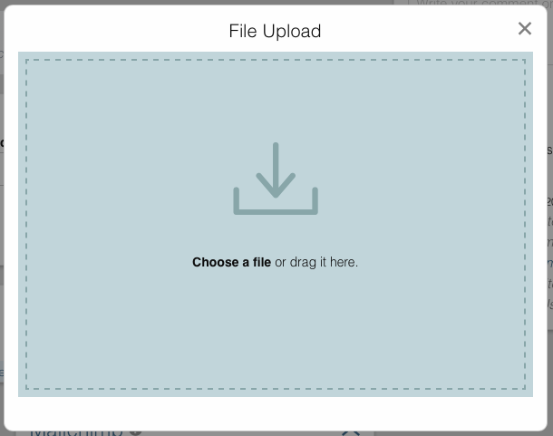
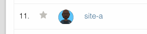
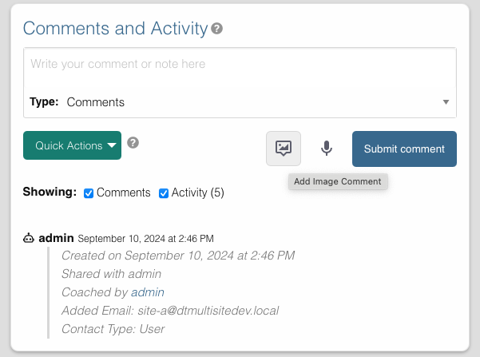

# Adding Pictures to Records

Add pictures to records in two locations: the record picture field and the comments section.

## Overview

When S3 storage is enabled, you can securely upload pictures to records such as contacts, groups, and other record types. Pictures are stored privately and are only accessible to authorized users.

## Record Picture

Each record can have a main picture displayed in the header and list views.

### Viewing the Record Picture

Click on the record picture to view it in full size.

### Uploading a Record Picture

1. Click the picture placeholder or existing picture in the record header
2. The upload modal opens
3. Choose your picture:
   - **Click to Browse**: Click "Choose file" to open file browser
   - **Drag and Drop**: Drag the picture directly onto the upload area
   - **Mobile Camera**: On mobile devices, take a photo directly
4. Upload begins automatically after selection

### List View Thumbnails

Record pictures appear as thumbnails in list views for quick visual identification.

## Picture Comments

Add pictures to the activity feed by posting picture comments.

### Posting a Picture Comment

1. In the "Comments and Activity" section, click the **image icon**
2. The upload modal opens
3. Add your image:
   - **Drag and Drop**: Drag an image file into the modal window
   - **Choose a File**: Click "Choose a file" to browse and select
4. Upload begins automatically
5. Picture appears in the activity feed once complete

Picture comments are useful for sharing screenshots, photos of events, or other visual information.

## Supported Formats

- **Formats**: `.gif`, `.jpg`, `.jpeg`, `.png`
- **Maximum size**: Varies by site configuration (typically 10MB)
- **Thumbnails**: System automatically generates optimized thumbnails

## Managing Pictures

### Record Pictures
- **View**: Click the picture to view full size
- **Replace**: Upload a new picture to replace existing
- **Delete**: Remove the picture (requires confirmation)

### Picture Comments
- **View**: Click the picture in the activity feed
- **Delete**: Delete the comment to remove the picture

Deleting a picture comment permanently removes it from storage.

## Security and Privacy

- **Private Storage**: Pictures are not publicly accessible
- **Encrypted Transfer**: All uploads use HTTPS
- **Access Control**: Only authorized users can view pictures
- **Temporary URLs**: Secure, time-limited links for viewing

## Best Practices

1. **Optimize Images**: Compress large images before upload
2. **Use Appropriate Formats**: JPEG for photos, PNG for graphics
3. **Security Awareness**: Avoid uploading sensitive personal photos
4. **Meaningful Pictures**: Use pictures that help identify or document the record

---

## Related Documentation

- [Voice Messages](./voice-messages.md)
- [Comments and Activity](./comments.md)
- [S3 Storage Settings](../wp-admin/dt-settings/storage/storage.md)
- [S3 Storage Setup Guide](../wp-admin/dt-settings/storage/storage-setup.md)
- [S3 Storage Usage Guide](../wp-admin/dt-settings/storage/storage-usage.md)
