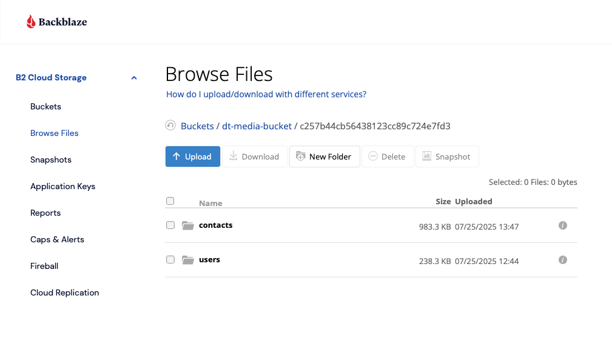

# Uploading Files to Records

Learn how to upload and manage files attached to records in Disciple.Tools using S3 storage.

## Overview

When S3 storage is enabled, Disciple.Tools allows you to securely upload files to records such as contacts, groups, and other record types. Files are stored privately in your configured S3 bucket and are only accessible to authorized users.


## Accessing File Upload Functionality

### Finding Upload Options

File upload options are available in different locations depending on the record type and field configuration:

1. **Record Details View**: Look for file upload buttons or image fields
2. **Comments Section**: Attach files to comments and activities


### Upload Button Locations

Common locations for file upload buttons:

- **Profile Pictures**: In user and contact profile sections
- **Record Images**: In record detail views
- **Comment Attachments**: In the comments and activity section


## File Upload Process

### Step 1: Initiate Upload

1. Navigate to the record where you want to upload a file
2. Look for the upload button or file field
3. Click the upload button to open the upload modal


### Step 2: Select Files

The upload modal provides multiple ways to select files:

#### File Selection Methods

1. **Click to Browse**: Click the "Choose file" button to open file browser
2. **Drag and Drop**: Drag files directly onto the upload area
3. **Mobile Camera**: On mobile devices, you can take photos directly


#### Supported File Types

The system accepts various file types depending on the field:

**Images**:
- `.gif`, `.jpg`, `.jpeg`, `.png`
- Maximum size: 10MB (varies by provider)
- Automatic thumbnail generation


**Audio Files**:
- `.mp3`, `.wav`, `.m4a`, `.webm`
- Maximum size: 10MB
- Playback controls available


### Step 3: Upload Progress

Once you select a file, the upload process begins automatically:

1. **File Validation**: System checks file type and size
2. **Upload Progress**: Progress bar shows upload status
3. **Processing**: File is processed and stored in S3
4. **Confirmation**: Success message confirms upload completion


### Step 4: File Management

After successful upload, you can manage your files:

- **View/Download**: Click to view or download the file
- **Replace**: Upload a new version of the file
- **Delete**: Remove the file (with confirmation)
- **Share**: Generate secure access links


## Upload Interface Features

### Drag and Drop Upload

The upload interface supports modern drag-and-drop functionality:

1. **Visual Feedback**: Upload area highlights when files are dragged over it
2. **File Validation**: Only accepted file types can be dropped
3. **Single File Limit**: Only one file can be uploaded at a time
4. **Error Prevention**: Invalid files are rejected with clear messages


### Upload Modal Interface

The upload modal includes several user-friendly features:

- **Large Upload Area**: Easy to target with drag-and-drop
- **File Type Icons**: Visual indicators for different file types
- **Progress Indicators**: Real-time upload status
- **Error Messages**: Clear feedback for any issues
- **Success Confirmation**: Visual confirmation of successful upload


### Mobile Upload Experience

On mobile devices, the upload experience is optimized for touch:

- **Touch-Friendly Interface**: Large buttons and touch targets
- **Camera Integration**: Direct photo capture and upload
- **Responsive Design**: Adapts to different screen sizes
- **Offline Handling**: Graceful handling of network issues


## File Storage and Security

### S3 Storage Benefits

Files uploaded to records are stored securely in your S3 bucket:

- **Private Storage**: Files are not publicly accessible
- **Encrypted Transfer**: All uploads use secure HTTPS connections
- **Access Control**: Only authorized users can view files
- **Secure URLs**: Temporary, time-limited access links
- **Audit Trail**: All file access is logged


### File Organization

Files are organized in your S3 bucket with the following structure:

```
your-bucket/
├── site-id-1/
│   ├── contacts/
│   ├── groups/
│   ├── users/
│   └── record-type-x/
└── site-id-2/
    ├── contacts/
    ├── groups/
    ├── users/
    └── record-type-x/
```

This organization ensures:
- **Site Isolation**: Each site's files are separated
- **Type Organization**: Files are grouped by purpose
- **Easy Management**: Clear structure for administrators



## Image Thumbnail Generation

For image uploads, the system automatically generates thumbnails:

### Thumbnail Sizes

- **Small Thumbnail**: 100px width for list views and previews
- **Large Thumbnail**: 1200px width for detailed views
- **Original Image**: Full resolution for download


### Thumbnail Features

- **Automatic Generation**: Created during upload process
- **Format Preservation**: Maintains original image format
- **Quality Optimization**: Balanced file size and image quality
- **Fallback Handling**: Shows original if thumbnail generation fails

## File Access and Sharing

### Viewing Uploaded Files

Once uploaded, files can be accessed in several ways:

1. **Direct View**: Click the file to view in browser
2. **Download**: Right-click to download the file
3. **Preview**: Hover over images to see preview
4. **Full Screen**: Click images to view in full screen


### Secure File Access

All file access is controlled through:

- **Presigned URLs**: Temporary, secure access links
- **Time Limits**: URLs expire after 24 hours
- **User Permissions**: Only authorized users can access files
- **Access Logging**: All file access is recorded


## Troubleshooting File Uploads

### Common Upload Issues

**File Too Large**:
- Check file size limits (typically 10MB)
- Compress images before upload
- Use appropriate file formats

**Invalid File Type**:
- Verify file extension is supported
- Check file content matches extension
- Convert to supported format if needed

**Upload Timeout**:
- Check internet connection stability
- Try uploading smaller files
- Retry the upload


### Error Messages

Common error messages and solutions:

| Error Message | Cause | Solution |
|---------------|-------|----------|
| "File too large" | Exceeds size limits | Compress file or use smaller file |
| "Invalid file type" | Unsupported format | Use supported file format |
| "Upload failed" | Network or server issue | Check connection and retry |
| "Access denied" | Permission issue | Contact administrator |

## Best Practices

### File Upload Best Practices

1. **Use Appropriate File Sizes**: Compress images and documents when possible
2. **Choose Right Formats**: Use web-optimized formats (JPEG for photos, PNG for graphics)
3. **Descriptive Names**: Use clear, descriptive filenames
4. **Regular Cleanup**: Remove unused or outdated files
5. **Security Awareness**: Don't upload sensitive personal information


### File Management Tips

- **Organize Files**: Use consistent naming conventions
- **Monitor Storage**: Keep track of storage usage
- **Backup Important Files**: Ensure critical files are backed up
- **Review Permissions**: Regularly review who has access to files

---

## Related Documentation

- [S3 Storage Settings](../wp-admin/dt-settings/storage.md) - Learn about S3 storage configuration
- [S3 Storage Setup Guide](../wp-admin/dt-settings/storage-setup.md) - Detailed setup instructions
- [S3 Storage Usage Guide](../wp-admin/dt-settings/storage-usage.md) - User interface features
- [S3 Storage Troubleshooting](../wp-admin/dt-settings/storage-troubleshooting.md) - Common issues and solutions
