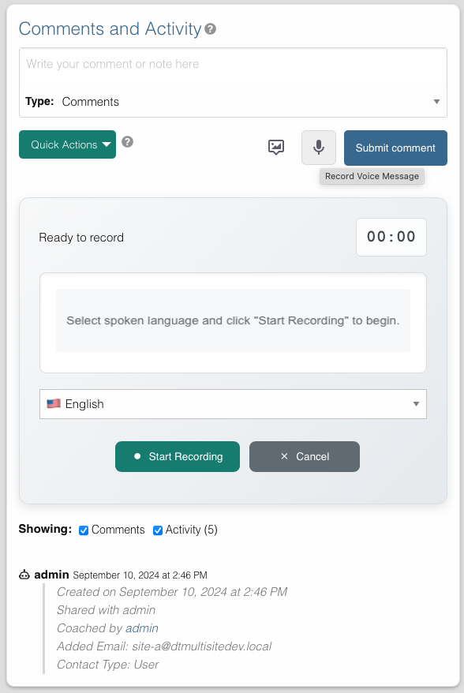
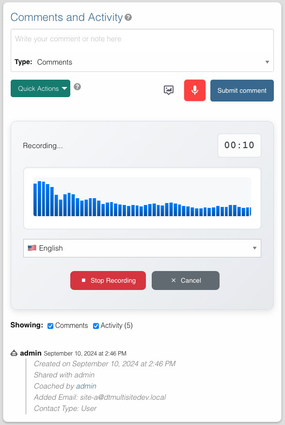
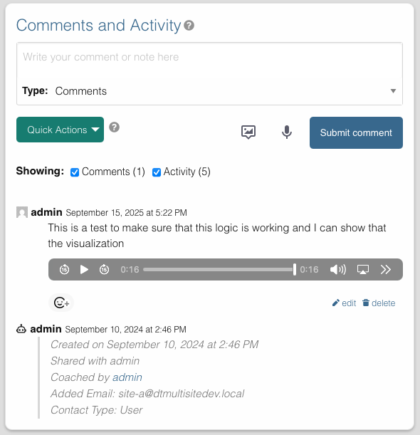

# Voice Messages

Record and attach voice messages to records in Disciple.Tools. Voice messages provide a convenient way to document interactions and leave audio notes.

## Overview

Voice messages can be recorded directly in the "Comments and Activity" section of any record (contacts, groups, etc.). This functionality requires S3 storage to be enabled by your administrator.

## Recording a Voice Message

### Access the Recorder

1. Navigate to any record's detail page
2. Locate the "Comments and Activity" section
3. Click the **microphone icon** to the left of the "Submit comment" button

### Record Your Message

1. **Grant Permission**: On first use, allow your browser to access your microphone
2. **Start Recording**: Click "Start Recording"
   - Timer begins counting
   - Sound wave visualization shows audio is being captured
3. **Stop Recording**: Click "Stop Recording" when finished
4. **Preview**: Use the audio player to listen to your recording
5. **Save or Cancel**:
   - Click "Save Recording" to upload and post
   - Click "Cancel" to discard the recording

## Audio Format

Recordings use browser-supported formats:
- **Primary**: WebM/Opus (most common)
- **Fallback**: OGG/Opus or MP4 (depending on browser)
- **No conversion**: Files saved in native browser format

The system automatically selects the best supported format for your browser.

## Playback and Management

### Viewing Voice Messages

Once saved, voice messages appear in the activity feed with:
- Audio player controls
- Recording duration
- Timestamp
- User who recorded it

Anyone with access to the record can listen to the voice messages.

### Deleting Voice Messages

To delete a voice message, delete the comment containing it:

1. Locate the voice message in the activity feed
2. Click the delete icon on the comment
3. Confirm deletion

Deleting the comment permanently removes the voice message from storage.

### Mobile Recording

Voice messages work on mobile devices with:
- Touch-optimized interface
- Built-in microphone support
- Responsive audio player
- Same recording workflow as desktop

## Security and Privacy

- **Private Storage**: Voice messages are not publicly accessible
- **Encrypted Transfer**: All uploads use HTTPS
- **Access Control**: Only authorized users can listen
- **Temporary URLs**: Secure, time-limited playback links

## Best Practices

1. **Test Microphone**: Verify microphone access before important recordings
2. **Quiet Environment**: Record in quiet locations for better audio quality
3. **Keep It Brief**: Shorter messages are easier to manage and review
4. **Review Before Saving**: Use preview to ensure recording quality
5. **Privacy Awareness**: Don't record sensitive personal information

---

## Related Documentation

- [Comments and Activity](./comments.md)
- [Add Pictures](./pictures.md)
- [S3 Storage Settings](../wp-admin/dt-settings/storage/storage.md)
- [S3 Storage Setup Guide](../wp-admin/dt-settings/storage/storage-setup.md)
- [S3 Storage Usage Guide](../wp-admin/dt-settings/storage/storage-usage.md)
