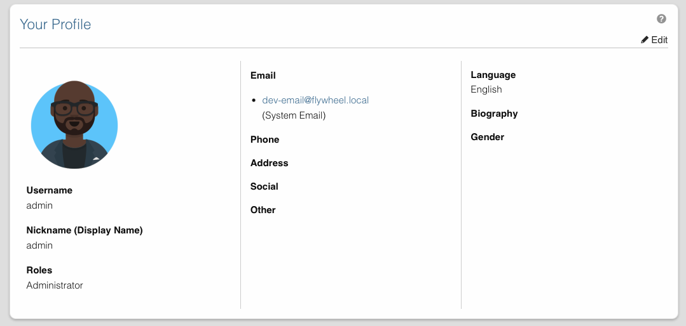
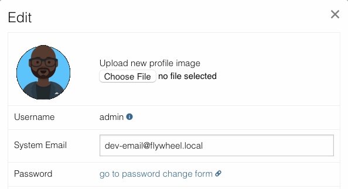

# Change Profile Picture

Learn how to upload or change your profile picture in Disciple.Tools.

## Overview

Disciple.Tools supports profile pictures through two different systems depending on your site's configuration:

1. **S3 Storage Upload** - Upload images directly to secure cloud storage when S3 connection is enabled
2. **Gravatar Integration** - Use Gravatar service when S3 storage is not available

## How to Change Your Profile Picture

### 1. Access Your Profile

**On Desktop**
Click on your **display name** in the top right corner of the screen to go to your profile settings.

**On Mobile**
1. Click the hamburger menu icon (☰) in the top right corner.
2. Click **Settings**.

### 2. Open the Edit Modal

1. On the settings page, locate the "Profile" section
2. Click the **"Edit"** button to open the edit profile modal
3. The modal will display your current profile picture at the top

### 3. Change Your Profile Picture

The profile picture options depend on your site's storage configuration:

#### Option A: S3 Storage Upload (When Storage is Enabled)

If your site has S3 storage connections enabled, you will see:

1. **Current Picture Display**: Your existing profile picture (or default avatar) appears at 100px width
2. **Upload Section**: Text reading "Upload new profile image" 
3. **File Input**: A button to select your image file
4. **Accepted Formats**: `.gif`, `.jpg`, `.jpeg`, `.png` files only
5. **Secure Storage**: Files are stored privately in your configured S3 bucket

**To upload a new picture:**
1. Click on the file input field
2. Select an image file from your device (GIF, JPG, JPEG, or PNG format)
3. The file will be selected for upload
4. Click the **"Save"** button at the bottom of the modal

**S3 Storage Benefits:**
- **Secure Storage**: Your profile picture is stored privately in cloud storage
- **Automatic Thumbnails**: System generates optimized thumbnails for display
- **Access Control**: Only authorized users can view your profile picture
- **Backup Protection**: Files are safely stored in redundant cloud storage

#### Option B: Gravatar Integration (Default)

If storage connections are not enabled, you will see:

1. **Current Picture Display**: Your Gravatar or default avatar at 32px size
2. **Gravatar Link**: Text reading "edit image on gravatar.com" with a link icon
3. **Tooltip Information**: Hover over the link to see security recommendations

**To change via Gravatar:**
1. Click on the "edit image on gravatar.com" link
2. This opens Gravatar.com in a new tab
3. Create a Gravatar account or log in with your existing account
4. Upload your desired profile image to Gravatar
5. Associate the image with the email address used in your Disciple.Tools account
6. Return to Disciple.Tools - your new Gravatar will appear automatically

### 4. Save Changes

1. After uploading a file (direct upload) or setting up Gravatar, click the **"Save"** button
2. The modal will close and your profile will be updated
3. Your new profile picture will appear in the Profile section

## Security and Privacy Recommendations

Disciple.Tools displays the following security guidance for profile pictures:

**For S3 Storage Systems:**
> "Disciple.Tools System does not store images. All media assets will be placed within specified media connection storage service. If you have security concerns, we suggest not using a personal photo, but instead choose a cartoon, abstract, or alias photo to represent you."

**For Gravatar Systems:**
> "Disciple.Tools System does not store images. For profile images we use Gravatar (Globally Recognized Avatar). If you have security concerns, we suggest not using a personal photo, but instead choose a cartoon, abstract, or alias photo to represent you."

### S3 Storage Security Features

When using S3 storage for profile pictures, your images benefit from:

- **Private Storage**: Images are not publicly accessible
- **Encrypted Transfer**: All uploads use secure HTTPS connections
- **Access Control**: Only authorized users can view your profile picture
- **Secure URLs**: Temporary, time-limited access links for viewing
- **Audit Trail**: All access to your profile picture is logged

## Troubleshooting

### Profile Picture Not Updating
1. **Clear browser cache** and refresh the page
2. **Check file format** - ensure you're using GIF, JPG, JPEG, or PNG
3. **Verify file size** - very large files may fail to upload
4. **For Gravatar**: Ensure the image is associated with the correct email address

### Upload Button Not Visible
If you don't see an upload option:
- Your site uses Gravatar integration instead of S3 storage uploads
- Contact your administrator if you need S3 storage capabilities
- Use the Gravatar method described above

### Gravatar Not Appearing
1. **Email match**: Ensure your Gravatar email exactly matches your Disciple.Tools system email
2. **Gravatar approval**: New images may take time to appear
3. **Rating settings**: Check that your image meets Gravatar's rating requirements

## Related Settings

- [Change System Email](change-system-email.md) - Update the email address used for Gravatar
- [Edit Personal Information](edit-personal-information.md) - Modify other profile details
- [Change User Language](change-user-language.md) - Set your interface language preferences

## Related Documentation

- [S3 Storage Settings](../wp-admin/dt-settings/storage.md) - Learn about S3 storage configuration
- [S3 Storage Setup Guide](../wp-admin/dt-settings/storage-setup.md) - Detailed setup instructions
- [S3 Storage Usage Guide](../wp-admin/dt-settings/storage-usage.md) - User interface features 