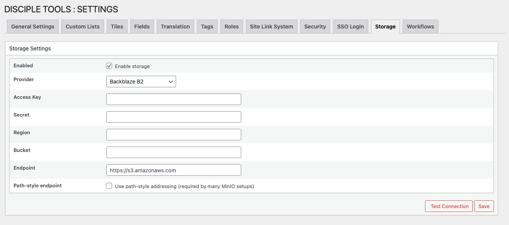
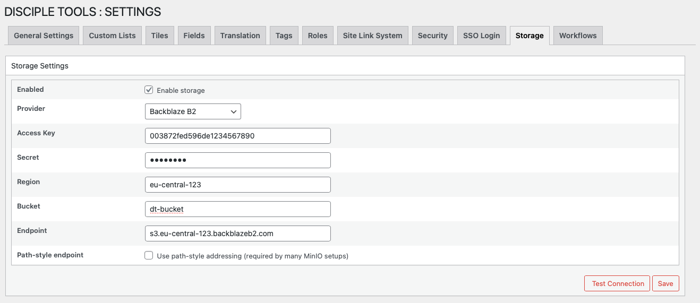
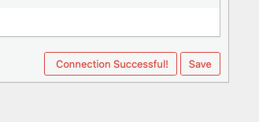

# Disciple.Tools Storage Settings

This document outlines how to configure external S3-compatible storage for your Disciple.Tools instance. By setting up an S3 connection, you can manage media and file uploads more efficiently and securely.

## Table of Contents

- **Getting Started**
    - [Why Use S3 Storage?](#why-use-s3-storage)
    - [Accessing Storage Settings](#accessing-storage-settings)
    - [Supported S3 Providers](#supported-s3-providers)
- **Configuration**
    - [Setting Up S3 Storage](./storage-setup.md)
    - [Connection Management Fields](#connection-management-fields)
    - [Testing Your Connection](#testing-your-connection)
- **User Features**
    - [Profile Picture Uploads](../../profile/change-profile-picture.md)
    - [Record File Uploads](../../details-view/uploading-files.md)
- [Voice and Picture Comments](../../details-view/details-voice-picture-comments.md)
- **Troubleshooting**
    - [Common Issues](./storage-troubleshooting.md)
    - [Connection Problems](./storage-troubleshooting.md#connection-issues)
    - [Upload Errors](./storage-troubleshooting.md#upload-errors)

---

## Why Use S3 Storage?

By default, WordPress stores all media uploads in a publicly accessible folder on your web server. This means that anyone with a link to a file can view it, which is not ideal for sensitive information.

Configuring S3 storage provides a secure alternative for handling media. When enabled, Disciple.Tools will upload certain media types to your private S3 bucket instead of the public WordPress media library. This is essential for:

-   **Profile Pictures**: Securely store profile pictures for users and contacts.
-   **Record Images**: Upload photos to records with the assurance that they are stored privately.
-   **Voice Messages**: Record and attach voice messages to records, keeping them confidential.

Using S3 compatible storage ensures that your media is protected and only accessible to authorized users.

## Accessing Storage Settings

To access the storage configuration page, follow these steps:

1.  Navigate to the WordPress Admin dashboard of your Disciple.Tools instance.
    - Click the settings icon (⚙️ on desktop, ☰ on mobile) and select **Admin**.
2.  From the main left sidebar, click on **Settings (D.T)**.
3.  Select the **Storage** tab.

## Supported S3 Providers

Disciple.Tools supports the following S3-compatible storage providers:

| Provider | Website | Default Path Style | Notes |
|----------|---------|-------------------|-------|
| **AWS S3** | [aws.amazon.com/s3](https://aws.amazon.com/s3) | No | Most popular cloud storage service |
| **MinIO** | [min.io](https://min.io) | Yes | Self-hosted S3-compatible storage; useful for local development and testing |
| **Backblaze B2** | [backblaze.com/b2](https://backblaze.com/b2) | No | Cost-effective cloud storage |
| **Cloudflare R2** | [cloudflare.com/products/r2](https://cloudflare.com/products/r2) | No | Zero egress fees |
| **Other S3-Compatible** | - | No | Any service supporting S3 API |

## Configuring an S3 Connection

The Storage tab contains settings for connecting to an S3-compatible object storage service like Amazon S3, MinIO, or other providers.

### Connection Management Fields

Here is a description of each field required to set up your S3 connection:

-   **Enabled**: Check this box to activate the external storage connection for your site. When disabled, the site will use the default local server storage.

-   **Provider**: Choose your S3 provider from the dropdown menu. The available options are dynamically populated based on the system's capabilities. Common choices include 'AWS' and 'MinIO'.

-   **Access Key**: Enter the Access Key ID provided by your S3 provider. This key is used for authenticating API requests.

-   **Secret**: Enter the Secret Access Key associated with your Access Key ID. This key is sensitive and will be stored securely. The field will show '********' if a key has already been saved. To update it, simply enter a new value.

-   **Region**: Specify the AWS region where your bucket is located (e.g., `us-east-1`). For non-AWS S3-compatible services, this value may vary.

-   **Bucket**: Enter the exact name of the S3 bucket you want to use for storage.

-   **Endpoint**: For S3-compatible services other than AWS, enter the custom service endpoint URL here (e.g., `https://s3.custom.com`). For AWS, this field is typically left blank unless you are using a custom endpoint.

-   **Path-style endpoint**: Enable this option if your storage provider requires path-style URL addressing (e.g., `https://s3.example.com/bucket-name`). This is commonly required for MinIO setups. If you are using Amazon S3, you can typically leave this disabled to use virtual-hosted-style addressing (e.g., `https://bucket-name.s3.example.com`).

## Testing Your Connection

After filling in all the required details, click the **Save** button to store your configuration. You can also click the **Test Connection** button to verify that your settings are correct and Disciple.Tools can successfully connect to the S3 bucket.

The test connection feature will:
- Validate your access credentials
- Check bucket permissions
- Upload a small test file
- Confirm the connection is working properly

If the test fails, check your credentials and bucket settings. For detailed setup instructions for each provider, see the [Storage Setup Guide](./storage-setup.md).

---

## Next Steps

- [Set up your S3 storage connection →](./storage-setup.md)
- [Learn about user file upload features →](./storage-usage.md)
- [Troubleshoot common issues →](./storage-troubleshooting.md)
