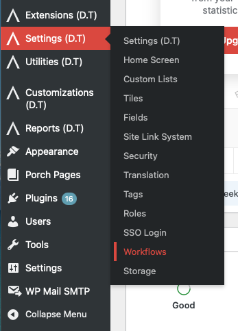

# Accessing the Workflows Page

The Workflows page is part of Disciple.Tools Settings. You need permission to access Settings (D.T) to see and use Workflows.

## From the Disciple.Tools Frontend

1. Log in to your Disciple.Tools site with an account that has administration access.
2. Open the WordPress Admin dashboard:
   - On desktop: click the settings icon (⚙️) and select **Admin**.
   - On mobile: tap the menu icon (☰) and select **Admin**.
3. In the main left sidebar, click **Settings (D.T)**.
4. Click the **Workflows** tab.

## From the WordPress Admin Directly

1. Log in to your site at the WordPress Admin URL (often `/wp-admin/`).
2. In the left sidebar, click **Settings (D.T)**.
3. Click the **Workflows** tab.

The Workflows page URL includes `page=dt_options` and `tab=workflows`. If you have a direct link to Settings (D.T), you can add `&tab=workflows` to open Workflows.

## Who Can Access Workflows?

Only users with permission to manage Disciple.Tools settings can open the Workflows page. If you do not see **Settings (D.T)** or the **Workflows** tab in the sidebar, your role does not have access. Ask your site administrator to adjust your permissions if you need to manage workflows.
