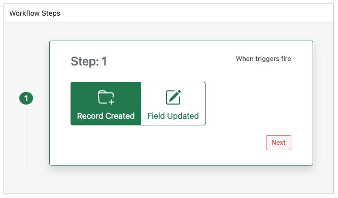
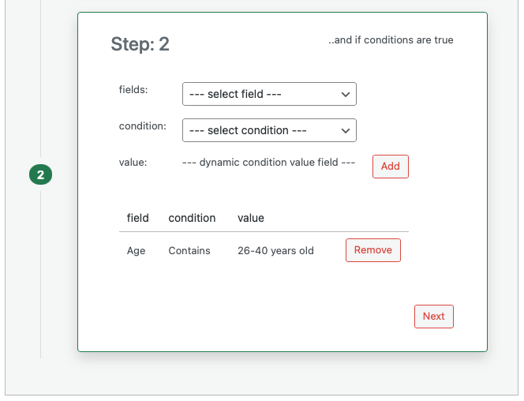
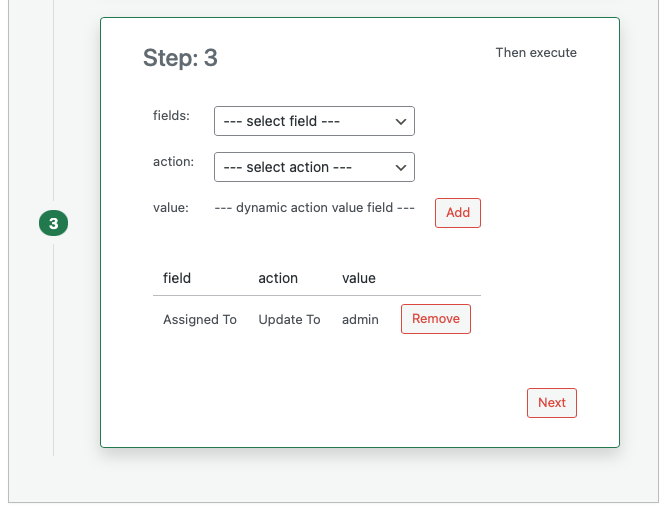
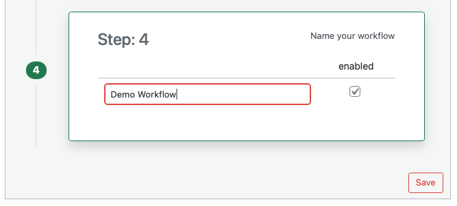

# Creating a Workflow

Follow these steps to create a new workflow in Disciple.Tools. Before you start, decide which record type it applies to, when it should run (trigger), and what conditions and actions you want.

## Prerequisites

- You have opened the Workflows page and selected a post type (for example Contacts or Groups). See [Accessing the Workflows Page](./accessing-workflows.md) and [Workflows Page Overview](./workflows-overview.md).
- You know the trigger (record created or field updated), the conditions (if any), and the actions you want.

## Step 1: Select the Post Type

If you have not already done so, click one of the post type buttons at the top (for example **Contacts** or **Groups**) so that the workflow list and design panel apply to that record type.

## Step 2: Open the New Workflow Form

Click the **New Workflow** button. The design panel appears with **Step 1** visible.

## Step 3: Choose the Trigger (Step 1)

1. Choose when the workflow should run:
   - **Record Created**: Runs when a new record of this type is created.
   - **Field Updated**: Runs when one or more fields on an existing record are updated.
2. Click **Next** to go to Step 2.

## Step 4: Add Conditions (Step 2)

Conditions are optional. If you add them, the workflow runs only when every condition is true.

1. In **fields**, select the field to check (for example Status or Assigned to).
2. In **condition**, select the rule (for example Equals, Contains, or Has any value and not empty). The list of conditions depends on the field type you chose.
3. If the condition needs a value (for example "Equals" needs a value to compare), enter or select the value in **value**. For "Has any value and not empty" and "Has no value or is empty" you do not enter a value.
4. Click **Add** to add this condition to the table.
5. Repeat for each condition you want. You can remove a row using the **Remove** button next to it.
6. Click **Next** to go to Step 3.

## Step 5: Add Actions (Step 3)

Actions are what the workflow does when the trigger and conditions are satisfied.

1. In **fields**, select the field to change or the special action (for example a field like Status, or Comments).
2. In **action**, select what to do (for example Updated To, Appended With, or Add Comment). The list of actions depends on the field you chose.
3. If the action needs a value (for example "Updated To" needs the new value), enter or select it in **value**.
4. Click **Add** to add this action to the table.
5. Repeat for each action you want. You can remove a row using the **Remove** button next to it.
6. Click **Next** to go to Step 4.

## Step 6: Name and Save (Step 4)

1. In the **Name your workflow** field, enter a clear name so you can find it later in the workflow list.
2. Check **enabled** if you want the workflow to run. If you leave it unchecked, the workflow is saved but will not run until you enable it.
3. Click **Save**.

The workflow is now saved. It will run whenever the trigger fires and all conditions are true. To change it later, click its name in the workflow list. For more on triggers and conditions, see [Triggers and Conditions](./workflows-triggers-and-conditions.md). For action types, see [Actions](./workflows-actions.md).
