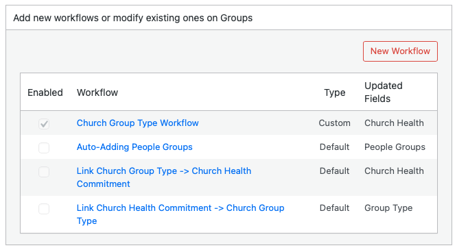

# Default Workflows

Disciple.Tools includes built-in workflows for some record types. These are called **default** workflows. You can turn them on or off, but you cannot edit their trigger, conditions, or actions, or delete them.

## What Default Workflows Exist?

Default workflows depend on your site and record types. Common examples include:

### Contacts

- **Select In Church/Group Following Group Addition**: When the Groups field is updated and has a value, this workflow can append a milestone (for example "In Group") to the contact’s Milestones field. It is useful for tracking when a contact is linked to a group.

### Groups

- **Link Church Health Commitment -> Church Group Type**: When the Health Metrics field contains "Church Commitment," this workflow can set the Group Type to "Church."
- **Link Church Group Type -> Church Health Commitment**: When the Group Type is set to "Church," this workflow can add "Church Commitment" to the Health Metrics field.
- **Auto-Adding People Groups**: When the group has members (Members field is set), this workflow can add the people groups from those members to the group’s People Groups field. This uses a custom action so the group’s people groups stay in sync with its members.

The exact names and availability may vary. Open the Workflows page, select **Contacts** or **Groups**, and look at the workflow list. Workflows with **Type** set to **Default** are built-in.

## Enabling or Disabling a Default Workflow

Default workflows are often **disabled** by default so you can choose which ones to use.

1. Open the Workflows page and select the post type (Contacts or Groups).
2. In the list, find the default workflow by name and **Type: Default**.
3. Click the workflow **name** to open the design panel.
4. In Step 4, check **enabled** to turn the workflow on, or uncheck it to turn it off.
5. Click **Save**.

The workflow will run only when it is enabled. You cannot change its trigger, conditions, or actions; you can only enable or disable it.

## Why Use Default Workflows?

Default workflows encode common ministry patterns (for example linking group type and health metrics, or syncing people groups from members). Enabling them can save your team from doing the same steps manually. If you do not need a default workflow, leave it disabled.
