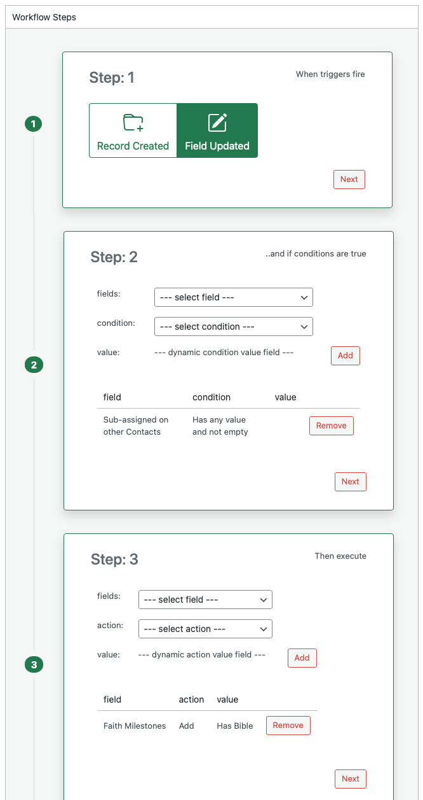

# Editing and Deleting Workflows

You can edit custom workflows, enable or disable any workflow, and delete only custom workflows. Default workflows provided by Disciple.Tools cannot be edited or deleted.

## Editing a Workflow

1. Open the Workflows page and select the correct post type (for example Contacts or Groups).
2. In the workflow list, click the **name** of the workflow you want to edit. The design panel opens and shows all four steps with the current trigger, conditions, and actions.
3. Change any step as needed:
   - **Step 1**: Change the trigger (Record Created or Field Updated).
   - **Step 2**: Add, change, or remove conditions using the **Add** and **Remove** buttons.
   - **Step 3**: Add, change, or remove actions using the **Add** and **Remove** buttons.
   - **Step 4**: Change the workflow name or the **enabled** checkbox.
4. Click **Save** to store your changes.

When you open a **Default** workflow, the design panel is read-only. You can only change whether it is **enabled** in Step 4 (or via the Enabled column in the list). You cannot change its trigger, conditions, or actions.

## Enabling and Disabling a Workflow

Only **enabled** workflows run when the trigger fires. To turn a workflow on or off:

- **From the list**: The **Enabled** column shows a checkbox for each workflow. The checkbox is display-only in the list; to change the state, open the workflow and use Step 4, or enable/disable when editing a custom workflow in Step 4.
- **From the design panel**: Open the workflow by clicking its name. In Step 4, check or uncheck **enabled**, then click **Save**.

Default workflows can be enabled or disabled the same way; you just cannot edit their trigger, conditions, or actions.

## Deleting a Workflow

You can delete only **Custom** workflows. Default workflows cannot be deleted.

1. Open the Workflows page and select the post type that contains the workflow.
2. Click the **name** of the custom workflow you want to delete. The design panel opens.
3. Click the **Delete** button. The **Delete** button appears only when a custom workflow is open.
4. Confirm if prompted. The workflow is removed from the list.

After deletion, the workflow no longer runs. Any past activity that was recorded as coming from that workflow may still show in the activity log, often under the name "D.T Workflow" if the workflow name is no longer available.
