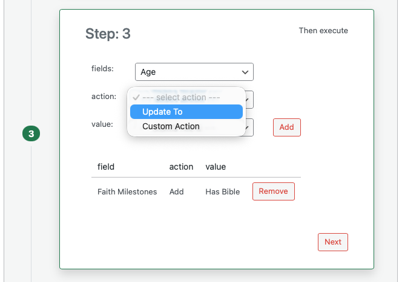

# Workflow Actions

Actions are what a workflow does when the trigger fires and all conditions are true. The actions available depend on the **field** you select; each field type supports certain action types.

## Action Types by Field Kind

### Update the Field to a Single Value

For fields that store one value (text, number, yes/no, single choice, assigned user, or date):

- **Updated To**: Set the field to the value you choose or enter. For dates you can often choose "Current" to use today’s date.
- **Unset**: Clear the value. Available for date fields only.

### Add or Remove Items in a List or Connection

For fields that store multiple items (tags, multi-select, connections, locations, communication channels, and similar):

- **Appended With** or **Add**: Add the value you choose to the field (for example add a tag or connect another record). The exact label may be "Appended With" or "Add" depending on the field.
- **Removal Of**: Remove the value you choose from the field (for example remove a tag or disconnect a record).

### Connection Fields

For connection fields that link to another record type:

- **Connect To**: Add a connection to the record you specify.
- **Removal Of**: Remove the connection to the record you specify.

### Comments

For the **Comments** field:

- **Add Comment**: Add a comment to the record. You type the comment text in the value field. You can use **tokens** to insert field values (see Comment tokens below).

### Share

For the **Share** field (who the record is shared with):

- **Add Share**: Share the record with the user you select.
- **Remove Share**: Remove sharing from the user you select.

### Custom Actions

If your site or a plugin provides **custom actions**, they appear in the action list. One built-in example is **Auto-Add People Groups** for Groups: when members are added to a group, it can add their people groups to the group’s people group field. Custom actions are configured by the system; you select them like any other action and set the field and value as shown in the design panel.

## Comment Tokens

When you use **Add Comment** as an action, you can type comment text that includes **tokens** so Disciple.Tools inserts values from the record. This is useful for noting what changed or for tagging people.

- Use curly braces and the field key: `{field_id}`. For example `{assigned_to}` for the Assigned to field.
- Only **connection** and **user** type fields support tokens in comments.
- Disciple.Tools replaces the token with the right value: for user fields it becomes an @mention (e.g. @[User Name](user-id)); for connection fields it becomes the linked record name or an @mention if that record corresponds to a user.

Example: If you type "Hello {assigned_to}, status was updated." and the Assigned to field is set to a user, the comment will show "Hello @[Jane](123), status was updated." so that user is notified.

## Running Order and Loops

Disciple.Tools runs the actions you defined. If an action would not change anything (for example the field already has that value), the system may skip it to avoid unnecessary updates. Workflow runs are attributed in the activity log so you can see that a change came from a workflow rather than a user.
