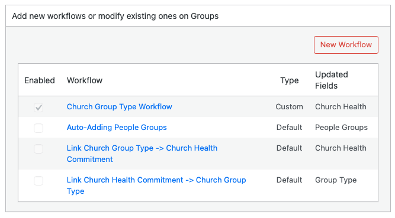

# Workflows Page Overview

The Workflows page has three main areas: a post type selector, a workflow list, and a design panel where you create or edit a workflow.

## Post Type Selector

At the top you see the question **For what post type?** with buttons for each record type (for example Contacts, Groups). You must select a post type before you can add or change workflows. Click one of the buttons to choose which record type you are working with. The page reloads and shows the workflows for that type.

## Workflow List (Add New Workflows or Modify Existing Ones)

After you select a post type, a section appears titled **Add new workflows or modify existing ones on [Post Type Name]**.

- **New Workflow**: Click this button to create a new workflow. The design panel opens with Step 1.
- **Table columns**:
  - **Enabled**: A checkbox indicating whether the workflow is active. Only enabled workflows run when the trigger fires.
  - **Workflow**: The workflow name. Click a name to open the design panel and view or edit that workflow.
  - **Type**: Either **Custom** (workflows you created) or **Default** (workflows provided by Disciple.Tools). Default workflows can only be enabled or disabled, not edited.
  - **Updated Fields**: A list of fields that the workflow changes when it runs (from its actions).

## Design Panel (Workflow Steps)

The design panel is hidden until you click **New Workflow** or a workflow name. It shows a four-step flow:

- **Step 1**: Choose the trigger (Record Created or Field Updated).
- **Step 2**: Add one or more conditions (field, condition type, and value).
- **Step 3**: Add one or more actions (field, action type, and value).
- **Step 4**: Enter a name for the workflow and set whether it is enabled. Then click **Save** or **Delete** (Delete appears only for custom workflows).

When you are creating a new workflow, the steps appear one after another as you click **Next**. When you open an existing workflow, all steps are visible so you can review or edit them.

For full steps to create a workflow, see [Creating a Workflow](./creating-a-workflow.md).
