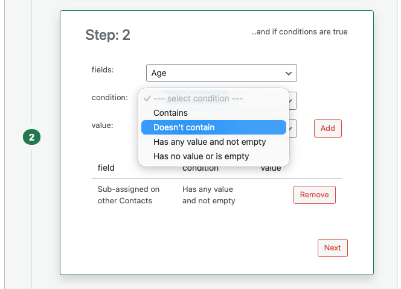

# Workflow Triggers and Conditions

Triggers define when a workflow runs. Conditions narrow that down so the workflow runs only when certain rules are true.

## Triggers

You choose one trigger per workflow.

### Record Created

The workflow runs when a **new record** of the selected type is created (for example when someone creates a new Contact or Group). All condition checks use the new record’s data. Use this when you want to do something as soon as a record exists (for example set a default status or add a comment).

### Field Updated

The workflow runs when **one or more fields** on an existing record are updated. Disciple.Tools only runs the workflow if at least one of the fields you use in your **conditions** was part of that update (or, for a newly created record, has a value). This avoids running the workflow when unrelated fields change. Use this when you want to react to a specific field change (for example when Status changes to "Active" or when Assigned to is set).

## Conditions

Conditions are optional. If you add conditions, **all** of them must be true for the workflow to run. You can add multiple conditions; each one is a row in the conditions table.

### Condition Types

The condition dropdown depends on the **field** you select. Different field types support different conditions.

- **Equals**: The field value equals the value you enter or select.
- **Doesn't equal**: The field value does not equal the value you enter or select.
- **Greater than**: The field value is greater than the value you enter. Available for number and date fields.
- **Less than**: The field value is less than the value you enter. Available for number and date fields.
- **Greater than or equals**: The field value is greater than or equal to the value you enter. Available for number and date fields.
- **Less than or equals**: The field value is less than or equal to the value you enter. Available for number and date fields.
- **Contains**: The field contains the value (for example text contains a word, or a multi-select list includes an option). Available for text and many list or connection-style fields.
- **Doesn't contain**: The field does not contain the value.
- **Has any value and not empty**: The field is set and not empty. You do not enter a value for this condition.
- **Has no value or is empty**: The field is empty or not set. You do not enter a value for this condition.

### Choosing a Condition Value

For most conditions you must enter or select a **value** (for example the status to compare to, or a number). For **Has any value and not empty** and **Has no value or is empty**, no value is needed; the value field is hidden.

The way you enter the value depends on the field type: some use a text box, some a dropdown of options, some a date picker, and some a search or typeahead for records or locations. Use the control that appears after you select the field and condition.

### Multiple Conditions

If you add more than one condition, the workflow runs only when **every** condition is true. There is no option to run when "any" condition is true; all must match.
