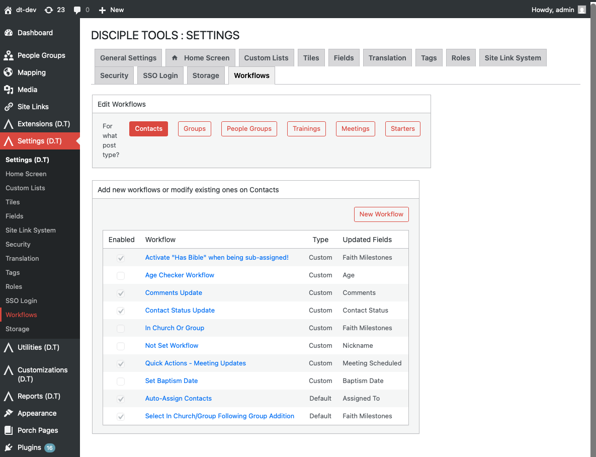

# Disciple.Tools Admin Workflows

Workflows in Disciple.Tools let you automate what happens when records are created or when fields are updated. You define a trigger, optional conditions, and actions. When the trigger fires and all conditions are true, Disciple.Tools runs the actions for you.

## What Are Workflows?

A workflow has three parts:

1. **Trigger**: When the workflow runs. Either when a record is **created** or when one or more **fields are updated**.
2. **Conditions**: Optional rules that must all be true (for example, "Status equals Active" or "Assigned to has a value"). If you add conditions, the workflow runs only when they are satisfied.
3. **Actions**: What Disciple.Tools does when the trigger and conditions are met. Examples include updating a field, adding a comment, connecting to another record, or running a custom action.

Workflows are defined per record type (for example Contacts or Groups). You can create your own workflows and enable or disable built-in default workflows.

## Why Use Workflows?

- Automatically set a field when another field changes (for example, set a milestone when a contact is added to a group).
- Add a comment or notification when something important happens.
- Keep linked fields in sync (for example, group type and health metrics).
- Reduce manual steps so your team can focus on ministry.

## Table of Contents

- [Accessing the Workflows Page](./accessing-workflows.md)
- [Workflows Page Overview](./workflows-overview.md)
- [Creating a Workflow](./creating-a-workflow.md)
- [Editing and Deleting Workflows](./editing-and-deleting-workflows.md)
- [Triggers and Conditions](./workflows-triggers-and-conditions.md)
- [Actions](./workflows-actions.md)
- [Default Workflows](./default-workflows.md)
- [Troubleshooting](./workflows-troubleshooting.md)

## Accessing the Workflows Page

To open the Workflows settings:

1. Go to the WordPress Admin dashboard (click the settings icon ⚙️ on desktop or ☰ on mobile, then select **Admin**).
2. In the left sidebar, click **Settings (D.T)**.
3. Click the **Workflows** tab.

For more detail and alternative paths, see [Accessing the Workflows Page](./accessing-workflows.md). For other Settings (D.T) options, see [Settings (D.T) overview](../index.md).

